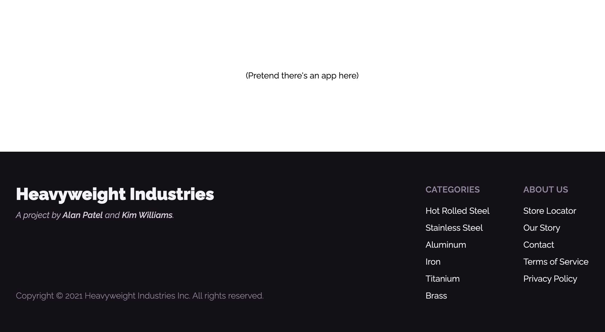

# Variable Fonts exercise

Update the typography so that it matches this screenshot:

**The bulk of the styling has already been completed;** your goal is to update the text styles.

Don't worry about mobile styles; this challenge is purely about the text.

You can access the design on Figma:

- https://www.figma.com/file/KbQfipRhstSKwc0EUbnJ71/Variable-Fonts-Exercise

## Font info

The font used is _Raleway_. A variable font has already been included in the `index.html` file, but it isn't being used anywhere yet.

## Setup Instructions

Because this project is pure HTML and CSS, you have two options:

1. You can open the `index.html` file directly in-browser
2. You can run `npm install` to install the `live-server` dependency, and then run `npm run start` to start a local file server. You'll be able to access the page at `http://localhost:5200` (assuming that the port is free).
